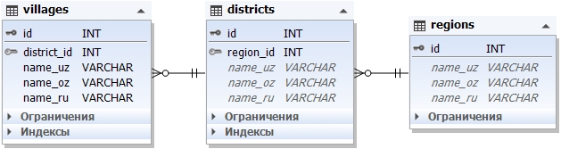

# 🌍 Regions, Districts &amp; Quarters Database

Full Database of regions Uzbekistan available in JSON, SQL  &amp; CSV Format All Regions, Districts &amp; Quarters with Latin, Cyrillic and Russian versions.


## Formats Available
- JSON
- SQL
- XML
- PLIST (Soon)
- YAML (Soon)
- CSV

## Distribution Files Info
File | JSON | SQL | XML | PLIST | YAML | CSV
:------------ | :-------------| :-------------| :------------- |:-------------|:-------------|:-------------
Regions / Cities | :white_check_mark: | :white_check_mark: | :white_check_mark: | :white_check_mark: | :white_check_mark: | :white_check_mark:
Districts | :white_check_mark: | :white_check_mark: | :white_check_mark: | :white_check_mark: | :white_check_mark: | :white_check_mark:
Quarters | :white_check_mark: | :white_check_mark: | :white_check_mark: | :white_check_mark: | :white_check_mark: | :white_check_mark:

## Database Backups
File | MySQL >= 5.6 | SQL Server >= 2017
:------------ | :-------------| :-------------
regions_mysql.sql | :white_check_mark: | N/A 
UzbekistanDB.bak | N/A | :white_check_mark: 

# Database Scheme Diagram




## Insights
Total Regions : 14 <br>
Total Regions/Cities : 204 <br>
Total Towns/Districts : 11,184+ <br>

Last Updated On : 13th March 2021

## Notes
```
There may be gaps between this information. 
Let us know if the information is incorrect or not entered!
```


## Contributors

Thanks goes to these wonderful people ([emoji key](https://allcontributors.org/docs/en/emoji-key)):

<table>
  <tr>
    <td align="center">
		<a href="https://github.com/kenjebaev">
			
			<br/>
			<sub>
				<b>Kenjebaev</b>
			</sub>
		</a>
		<br/>
		<a href="https://github.com/MIMAXUZ/uzbekistan-regions-data/commits?author=kenjebaev" title="Code">💻</a>
		<a href="http://www.kenjebaev.uz" title="Ideas & Planning, Feedback">👀</a>
	</td>
    <td align="center">
		<a href="https://github.com/mimaxuz">
			
			<br/>
			<sub>
				<b>MIMAXUZ</b>
			</sub>
		</a>
		<br/>
      <a href="https://github.com/MIMAXUZ/uzbekistan-regions-data/commits?author=kenjebaev" title="Code">💻</a>
		<a href="http://www.yaqubov.info" title="Ideas & Planning, Feedback">😊</a>
	</td>
	<td align="center">
		<a href="https://github.com/Yakubov01">
			
			<br/>
			<sub>
				<b>Yakubov01</b>
			</sub>
		</a>
		<br/>
      <a href="https://github.com/MIMAXUZ/uzbekistan-regions-data/commits?author=kenjebaev" title="Code">💻</a>
		<a href="http://www.yaqubov.info" title="Ideas & Planning, Feedback">😊</a>
	</td>
  </tr>
</table>

Contributions of any kind welcome! We look forward to all the helpers...


## Follow me at
<a href="https://github.com/mimaxuz/"></a> 
<a href="https://www.linkedin.com/in/mimaxuz/"></a>

## Suggestions / Feedbacks
```
Suggestions & Feedbacks are Most Welcome
oktam[at]yaqubov[dot]info
```

That's all Folks. Enjoy😊!
